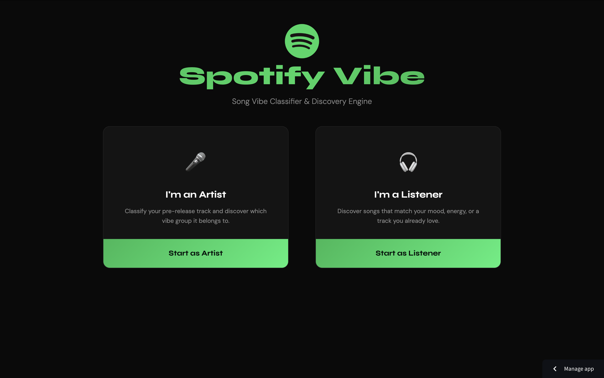
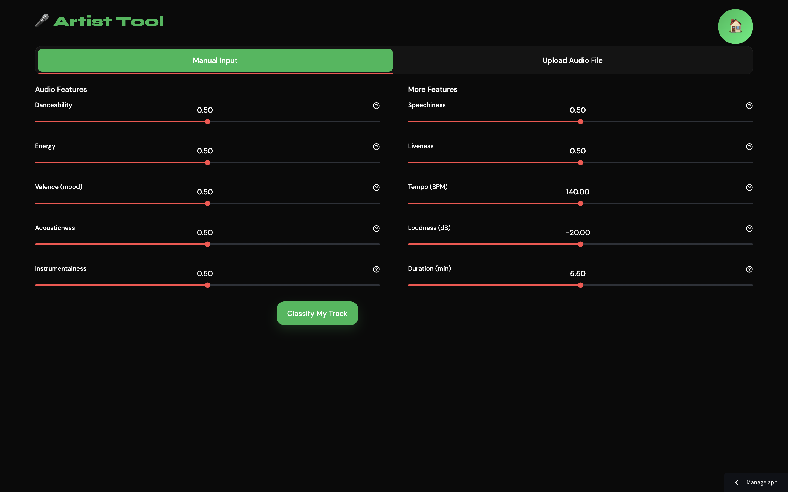
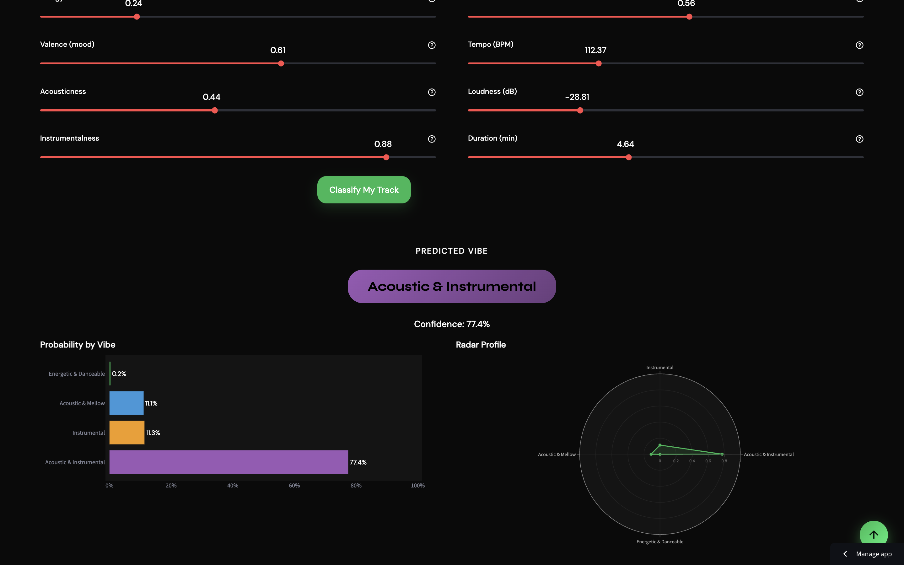
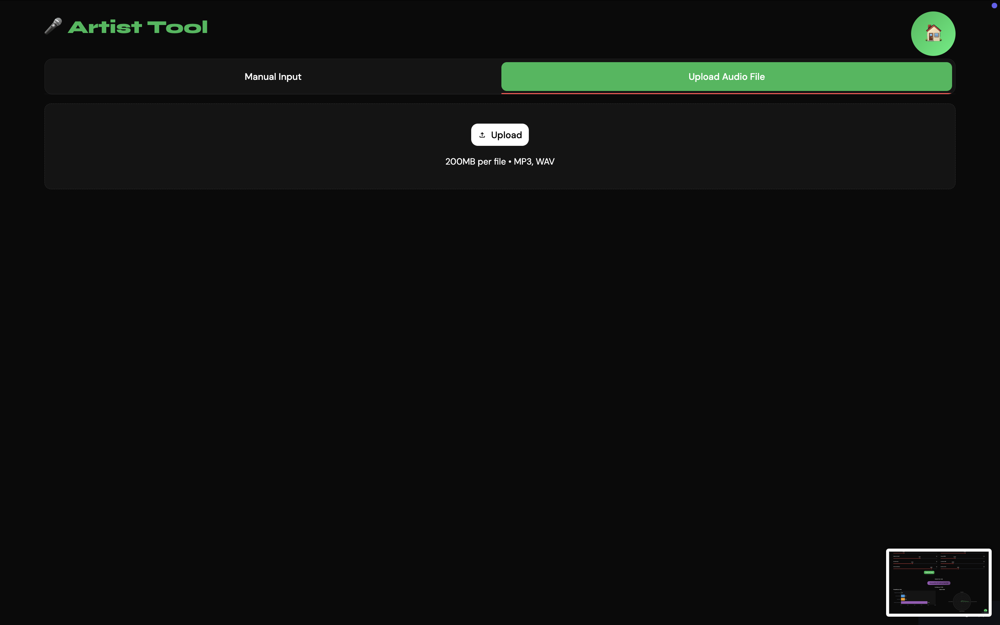
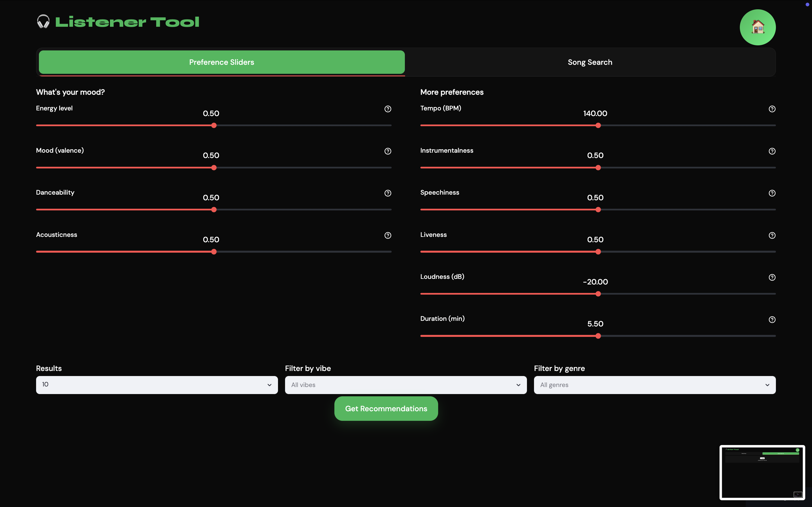
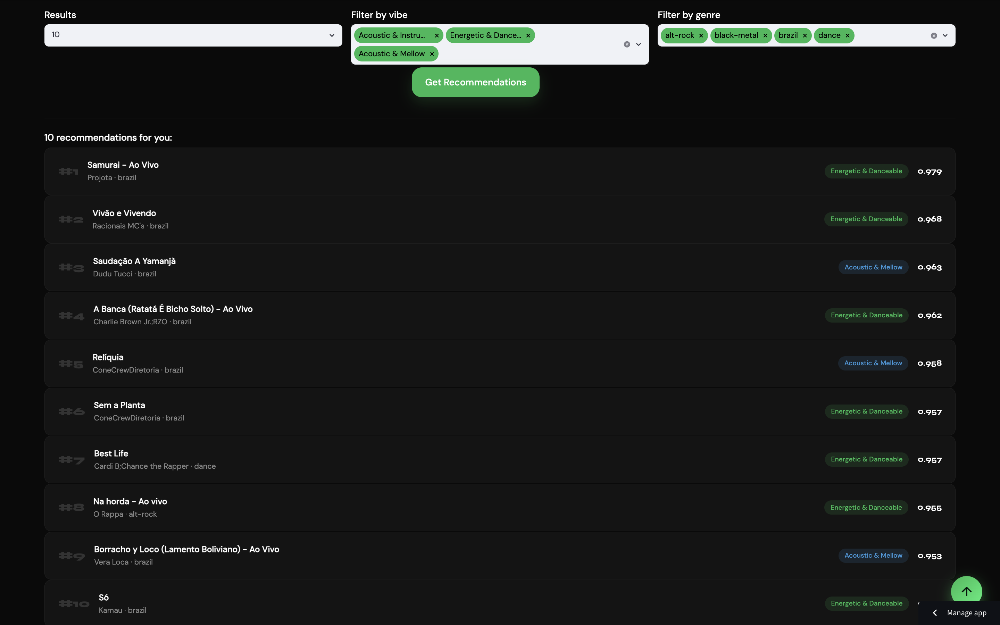
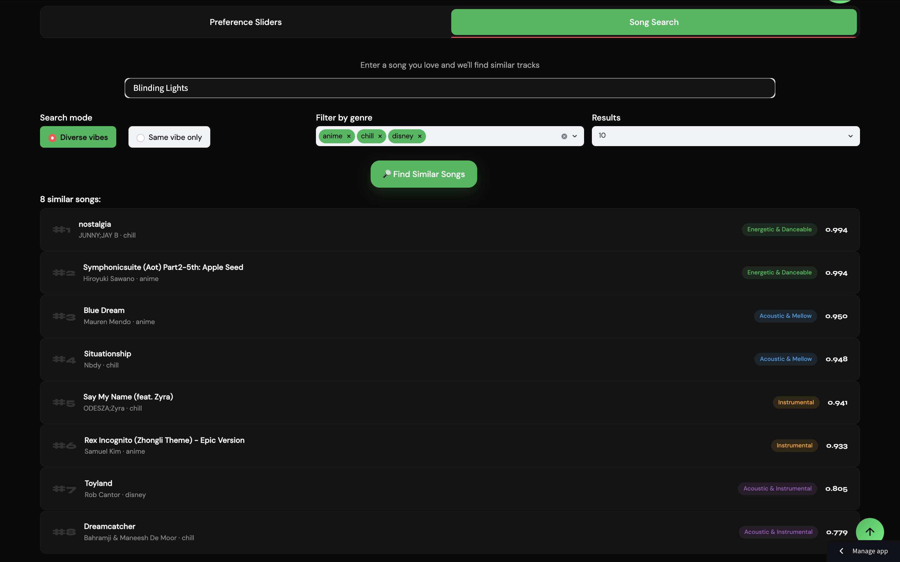

# Spotify Vibe Classifier & Recommendation System

## Live Demo

[Launch Spotify Vibe App](https://tracychanty-spotify-vibe.streamlit.app/)

<details>
<summary>Dashboard Screenshots (Click to view)</summary>

<br>

**Home Page**



<br><br>

**Vibe Classification**



<br><br>



<br><br>



<br><br>

**Music Recommendations**



<br><br>



<br><br>



</details>

---

## Project Overview

This project is an end-to-end music machine learning system built on Spotify track features. It combines unsupervised learning, supervised classification, and similarity-based recommendation inside a custom Streamlit web app, creating an interactive Spotify-inspired music discovery experience.

The project has two main user flows:
- `Artist Tool`: classify a track into a vibe category using audio features
- `Listener Tool`: discover similar songs based on mood/preferences or a song search

The full workflow is documented in [`code_final.ipynb`](./code_final.ipynb) and deployed through [`web.py`](./web.py).

The pipeline works like this:
1. Clean and preprocess a Spotify track dataset
2. Use K-Means clustering to discover vibe groupings from audio features
3. Name the resulting clusters as interpretable vibe labels
4. Train a Random Forest classifier to predict those vibe labels
5. Build a cosine-similarity recommendation engine for song matching
6. Serve the system in a styled Streamlit interface

---

## Key Results

- Processed 114,000 Spotify tracks
- Built 4 interpretable vibe segments using K-Means
- Achieved 99.05% classification accuracy
- Achieved 0.988 macro F1-score
- Generated real-time music recommendations using cosine similarity
- Deployed an interactive Streamlit web application

---

## Project Architecture

```
Spotify Dataset
      ↓
Data Cleaning & Feature Engineering
      ↓
K-Means Clustering
      ↓
Vibe Labels
      ↓
Random Forest Classifier
      ↓
Artist Tool
      ↓
Vibe Prediction


Spotify Dataset
      ↓
Feature Scaling
      ↓
Cosine Similarity
      ↓
Recommendation Engine
      ↓
Listener Tool
      ↓
Music Recommendations


Both Pipelines
      ↓
Streamlit Web App
```

---

## Business Problem

Spotify contains millions of tracks, making music discovery difficult for both listeners and independent artists.

This project addresses two challenges:

1. Helping listeners discover songs that match their musical preferences.
2. Helping artists understand how their songs are perceived based on audio characteristics.

The system combines clustering, classification, and recommendation techniques to create a personalized music discovery experience.

---

## Dataset

Dataset source: Spotify Tracks Dataset from Kaggle 
(https://www.kaggle.com/datasets/maharshipandya/-spotify-tracks-dataset/data)

- Raw dataset size: `114,000` tracks
- Cleaned modeling dataset: `80,800` tracks
- Genres covered: `114`
- Unique artists: `31,437`
- Unique albums: `46,589`
- Null values after cleaning: `0`

---

## Feature Engineering

Several transformations were applied before modeling:

- Removed missing and duplicate records
- Converted duration from milliseconds to minutes
- Standardized numerical audio features
- Selected 11 audio features for clustering and classification
- Exported recommendation-ready feature matrices for fast retrieval

---
  
## Machine Learning Components

### Vibe Classification Model

The classification model predicts a song's vibe category using 11 track-level features:
- danceability
- energy
- valence
- tempo
- acousticness
- speechiness
- liveness
- instrumentalness
- loudness
- explicit
- duration_min

The system groups tracks into 4 vibe classes:
- Energetic & Danceable
- Acoustic & Mellow
- Instrumental
- Acoustic & Instrumental

### Recommendation System

The recommendation engine uses a scaled feature matrix and cosine similarity to retrieve similar songs.

It supports two flows:
- Preference-based: users move sliders for mood, energy, danceability, tempo, and related features
- Song-based: users search for a track name and get similar songs

Available filters in the app include:
- vibe filtering
- genre filtering
- result count selection
- same-vibe vs diverse-vibe retrieval

---

## Model Performance

### Clustering Quality

- K-Means with `k = 4`
- Silhouette score: `0.3165`
- Davies-Bouldin score: `1.1806`

### Classification Performance

The vibe classifier is a `RandomForestClassifier`.

Evaluation results:
- Test accuracy: `0.9905`
- Macro F1-score: `0.9883`
- 5-fold CV macro F1 mean: `0.9871`
- 5-fold CV macro F1 std: `0.0011`

### Recommendation System Validation

The recommendation engine was manually validated by testing
multiple seed songs across genres and verifying that returned
tracks exhibited similar audio characteristics and vibe profiles.

Similarity retrieval is based on cosine similarity over a scaled
audio-feature space.

---

## Web Appplication

The Streamlit app in [`web.py`](./web.py) provides two interfaces:

### Artist Tool

- manual audio-feature input with sliders
- vibe prediction with confidence score
- probability bar chart
- radar chart of vibe probabilities

### Listener Tool

- preference slider recommendations
- song search recommendations
- genre and vibe filters
- styled recommendation cards

---

## Repository Structure

```text
.
├── code_final.ipynb        # full analysis, preprocessing, clustering, classification, recommendation
├── web.py                  # Streamlit web application
├── style.css               # custom app styling
├── dataset.csv             # original dataset used in the notebook
├── rec_catalogue.csv       # exported recommendation catalogue
├── vibe_classifier.pkl     # trained Random Forest classifier
├── vibe_names.pkl          # saved vibe label mapping
├── rec_scaler.pkl          # fitted scaler for recommendation features
├── rec_matrix.npy          # scaled matrix used for cosine similarity
├── spotify_logo.png        # app branding asset
├── requirements.txt 
└── README.md
```

---

## Technologies Used

### Programming & Machine Learning

- Python
- Pandas
- NumPy
- Scikit-learn
- SciPy
- Joblib

### Visualization
- Plotly
- Matplotlib
- Seaborn

### Web Development
- Streamlit
- HTML/CSS

---

## Future Improvements

- Integrate Spotify API for live track retrieval
- Support playlist-level vibe analysis
- Replace cosine similarity with neural embedding models
- Experiment with hybrid collaborative + content-based recommendations
- Deploy with user authentication and personalized recommendation history

---

## How to Run

### 1. Clone the repository

```bash
git clone https://github.com/tracychanty/spotify-classification-recommendation-system.git
```

### 2. Navigate to the project folder

```bash
cd spotify-classification-recommendation-system
```

### 3. Install dependencies

```bash
pip install -r requirements.txt
```

### 4. Launch the web app

```bash
streamlit run web.py
```
